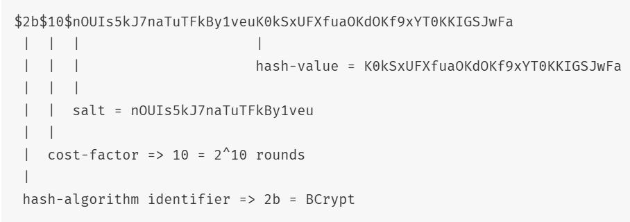

---

# 🔐 `bcrypt` – Secure Password Hashing ka King!

## 📌 Kya hai `bcrypt`?

`bcrypt` ek password-hashing function hai jo passwords ko **secure** banata hai by encrypting them.  
Iska use login systems me hota hai jahan user ke passwords ko **directly store** karna unsafe hota hai.

---

## ⚙️ Kaise Kaam Karta Hai?

### Step-by-step ⛓️:

1. 🧂 **Salt Generate Karna**  
   - Ek **random string (salt)** banaya jata hai har password ke liye  
   - Ye prevent karta hai **rainbow table attacks** ko

2. 🔄 **Hashing Process**  
   - `bcrypt` password + salt leke use multiple rounds (default 10) me hash karta hai  
   - Har round me processing time increase hoti hai → brute force attack difficult hota hai

3. 💾 **Hash Store Karna**  
   - Final hash ke andar salt bhi hota hai  
   - Jab user dobara login karta hai, wahi salt use karke compare kiya jata hai

---

## 🧑‍💻 Implementation (Node.js ke saath)

### 📦 1. Install karo:
```bash
npm install bcrypt
```

---

### 🔏 2. Hashing Password Example:

```js
const bcrypt = require('bcrypt');
const saltRounds = 10;

const password = 'meraStrongPassword';

bcrypt.hash(password, saltRounds, function(err, hash) {
  if (err) throw err;
  console.log("🔒 Hashed Password:", hash);
});
```

---

### ✅ 3. Compare karo (Login ke waqt):

```js
const enteredPassword = 'meraStrongPassword';
const savedHash = '$2b$10$8Txygk6...'; // DB se hash aaya hai

bcrypt.compare(enteredPassword, savedHash, function(err, result) {
  if (err) throw err;
  if (result) {
    console.log("🟢 Password Match!");
  } else {
    console.log("🔴 Wrong Password!");
  }
});
```

---

## 📚 Tips:

- 🕐 **Salt rounds = zyada security, but slow** → default 10 is good
- 🚫 Never store passwords as plain text
- 🔁 Use `async/await` version for better code readability

---

## 🧠 Summary:

| Feature         | Description |
|----------------|-------------|
| 🧂 Salt         | Random string added to password |
| 🔐 Hashing      | Secure encryption process |
| 🛡️ Protection   | Prevents brute-force and rainbow attacks |
| ✅ Compare      | Match password securely |

---

